# Dag기반 Workflow Demo

## 기존 프로젝트

- 기술 스택
    - 프론트엔드
        - 언어
            - Javascript
            - React 18
        - Test
            - MSW (Mock Service Worker)
    - 백엔드
        - 언어
            - Java
            - Spring Boot
        - Test
            - Jest
- 개요
    - 핵심 문제
        - 데이터 및 업무 파이프 라인은 보통 코드와 인프라 설정이 분리
        - 고객사 내부에서 엔지니어와 개발자 사이의 간극이 있음
        - 따라서 엔지니어가 고객사내의 데이터를 확인할 수 있은 Dag 및 코드 작성 기능이 필수로 대두됨
    - 목표
        - 워크플로의 정의 → 코드 작성 →(S3 or MinIO) → 배포 및 검증 → 실행 → 모니터링까지 한 프로그램에 안에서 끝나는 End to End Workspace 제작
    - 기능 구현
        - 코드 작성 기능
        - 배포 및 검증 기능
        - 코드 실행 및 knative를 통해서 전체 프로세스 실행
    - 기능 미구현
        - kafka 및 필요한 메타데이터 송수신 X
        - 코드 작성 및 실행은 되지만 디버깅 기능 삽입 X
        - S3 or MinIO로 적재 불가능
        - 모니터링 시스템
- 핵심 기능
    - 프론트엔드
        - 노드 와 엣지 연결을 통한 워크플로우 설계 및 저장
        - Monaco 기반 코드 작성
    - 백엔드
        - Kubernetes 배포 자동화 Knative Service로 단계별 런타임 생성 및 이벤트 기반 실행
        - SSE로 배포 및 검증 프로세스를 스트리밍 하여 UI에서 즉시 확인
- 전체 시스템
    - Dag페이지
    
    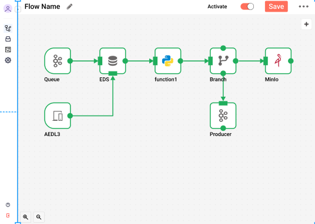
    
    - Code Section
    
    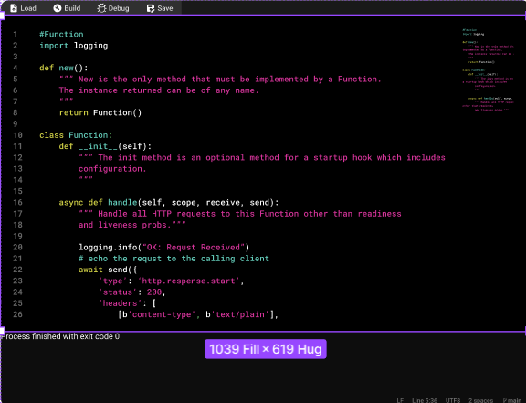
    
    - 모니터링 시스템
    
    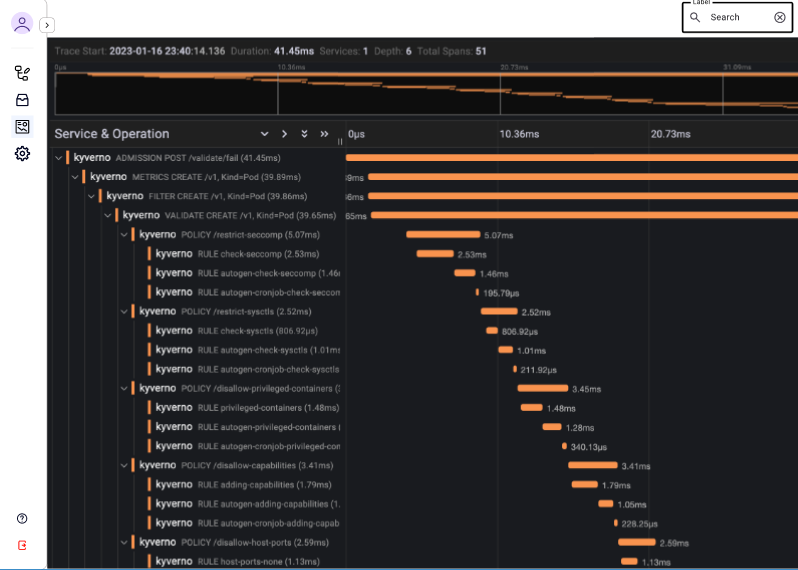
    
- ERD

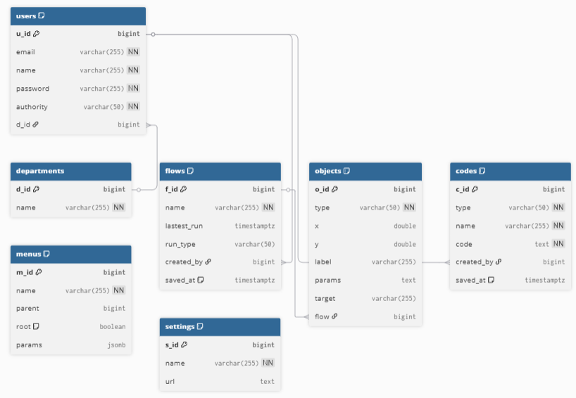

## 포트폴리오

- 기술 스택
    - 프론트엔드
        - Typescript
        - React
    - 백엔드
        - Go
        - Python
    - 학습 파이프라인
        - Pytorch
        - CUDA
    - 인프라 및 배포
        - Docker
        - Nginx
        - Kubernetes
    - 데이터베이스
        - PostgresSQL
    - 서비스
        - JupyerLab
        - Ollama
- 프로그램 구조

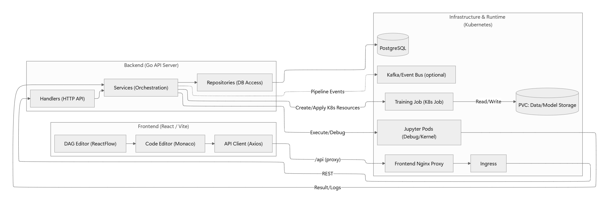

- 프로그램
    - AI Agent
    
    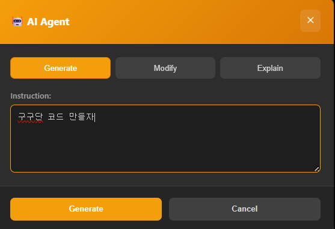
    
    - 코드 작성
    
    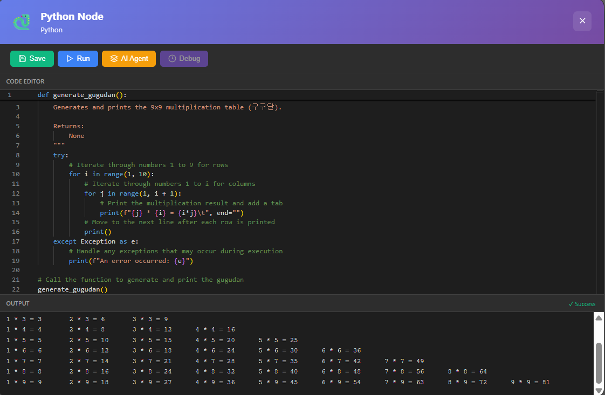
    
- 노드 연결
    
    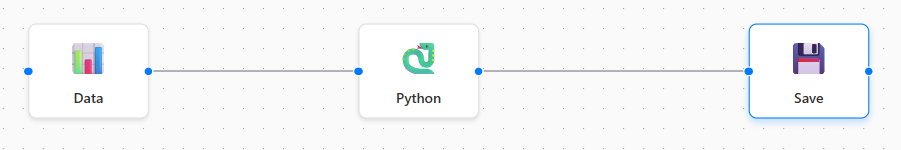
    
- 성공 메시지
    
    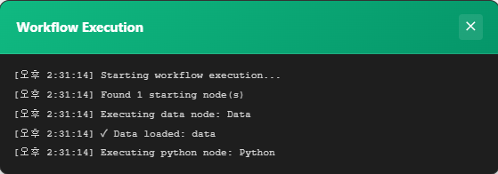
    
- 파일 적재
    
    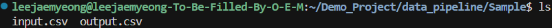
    
- 학습 자동화

  ![image.png]data_pipeline/(img/automation.png)

### Kubernetes 기능 분석

- 사전 요구 사항

```go
minikube status
minikube
type: Control Plane
host: Running
kubelet: Running
apiserver: Running
kubeconfig: Configured
```

- 배포

```bash
cd ~/Demo_Project/data_pipeline/k8s && ./deploy.sh
```

- 배포 상태 확인

```bash
kubectl get pods -n data-pipeline
```

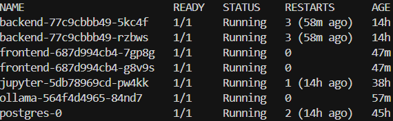

- 포트포워딩 설정

```bash
# 1. Frontend (웹 UI)
kubectl port-forward svc/frontend-service 3000:80 -n data-pipeline

# 2. Backend API
kubectl port-forward svc/backend-service 8080:8080 -n data-pipeline

# 3. Jupyter Notebook
kubectl port-forward svc/jupyter-service 8888:8888 -n data-pipeline

# 4. PostgreSQL Database
kubectl port-forward svc/postgres-service 5432:5432 -n data-pipeline

# 5. Ollama AI (LLM 서비스)
kubectl port-forward svc/ollama-service 11434:11434 -n data-pipeline
```

- 접속

| 서비스 | 포트 | 접속 URL |
| --- | --- | --- |
| Frontend | 3000 | http://localhost:3000 |
| Backend API | 8080 | http://localhost:8080 |
| Jupyter | 8888 | http://localhost:8888 |
| PostgreSQL | 5432 | localhost:5432 |
| Ollama | 11434 | http://localhost:11434 |
- Ingress 라우팅

```yaml
apiVersion: networking.k8s.io/v1
kind: Ingress
metadata:
  name: data-pipeline-ingress
  namespace: data-pipeline
  annotations:
    nginx.ingress.kubernetes.io/rewrite-target: /
    nginx.ingress.kubernetes.io/ssl-redirect: "false"
    # Enable CORS
    nginx.ingress.kubernetes.io/enable-cors: "true"
    nginx.ingress.kubernetes.io/cors-allow-methods: "GET, POST, PUT, DELETE, OPTIONS"
    nginx.ingress.kubernetes.io/cors-allow-origin: "*"
    # WebSocket support for SSE
    nginx.ingress.kubernetes.io/proxy-read-timeout: "3600"
    nginx.ingress.kubernetes.io/proxy-send-timeout: "3600"
    # Large body size for file uploads
    nginx.ingress.kubernetes.io/proxy-body-size: "50m"
spec:
  ingressClassName: nginx
  rules:
  # Frontend - main application
  - host: app.data-pipeline.local
    http:
      paths:
      - path: /
        pathType: Prefix
        backend:
          service:
            name: frontend-service
            port:
              number: 80
  # Backend API - separate domain
  - host: api.data-pipeline.local
    http:
      paths:
      - path: /
        pathType: Prefix
        backend:
          service:
            name: backend-service
            port:
              number: 8080
  # Alternative: Single domain with path-based routing
  - host: data-pipeline.local
    http:
      paths:
      # API requests go to backend
      - path: /api
        pathType: Prefix
        backend:
          service:
            name: backend-service
            port:
              number: 8080
      # Everything else goes to frontend
      - path: /
        pathType: Prefix
        backend:
          service:
            name: frontend-service
            port:
              number: 80
```

- Kubernetes에서 실행하는 컴포넌트
    - Jupyter
    
    ```yaml
    apiVersion: v1
    kind: Service
    metadata:
      name: jupyter-service
      namespace: data-pipeline
      labels:
        app: jupyter
    spec:
      type: ClusterIP
      ports:
        - port: 8888
          targetPort: 8888
          protocol: TCP
          name: http
      selector:
        app: jupyter
    ---
    apiVersion: apps/v1
    kind: Deployment
    metadata:
      name: jupyter
      namespace: data-pipeline
      labels:
        app: jupyter
    spec:
      replicas: 1
      selector:
        matchLabels:
          app: jupyter
      template:
        metadata:
          labels:
            app: jupyter
        spec:
          containers:
          - name: jupyter
            image: jupyter/scipy-notebook:latest
            ports:
            - containerPort: 8888
              name: http
            env:
            - name: JUPYTER_ENABLE_LAB
              value: "yes"
            - name: JUPYTER_TOKEN
              valueFrom:
                secretKeyRef:
                  name: app-secrets
                  key: JUPYTER_TOKEN
            - name: JUPYTER_PORT
              value: "8888"
            command:
            - start-notebook.sh
            args:
            - --NotebookApp.token=''
            - --NotebookApp.password=''
            - --NotebookApp.allow_origin='*'
            - --NotebookApp.disable_check_xsrf=True
            - --NotebookApp.ip=0.0.0.0
            - --NotebookApp.port=8888
            resources:
              requests:
                memory: "1Gi"
                cpu: "500m"
              limits:
                memory: "2Gi"
                cpu: "1000m"
            volumeMounts:
            - name: jupyter-workspace
              mountPath: /home/jovyan/work
          volumes:
          - name: jupyter-workspace
            emptyDir: {}
    ```
    
    - Ollama
    
    ```yaml
    apiVersion: apps/v1
    kind: Deployment
    metadata:
      name: ollama
      namespace: data-pipeline
      labels:
        app: ollama
    spec:
      replicas: 1
      selector:
        matchLabels:
          app: ollama
      template:
        metadata:
          labels:
            app: ollama
        spec:
          containers:
          - name: ollama
            image: ollama/ollama:latest
            ports:
            - containerPort: 11434
              name: http
            env:
            - name: OLLAMA_HOST
              value: "0.0.0.0:11434"
            - name: OLLAMA_KEEP_ALIVE
              value: "24h"
            resources:
              requests:
                memory: "8Gi"
                cpu: "2"
              limits:
                memory: "16Gi"
                cpu: "4"
            volumeMounts:
            - name: ollama-data
              mountPath: /root/.ollama
          volumes:
          - name: ollama-data
            persistentVolumeClaim:
              claimName: ollama-pvc
    ---
    apiVersion: v1
    kind: Service
    metadata:
      name: ollama-service
      namespace: data-pipeline
      labels:
        app: ollama
    spec:
      type: ClusterIP
      ports:
      - port: 11434
        targetPort: 11434
        protocol: TCP
        name: http
      selector:
        app: ollama
    ---
    apiVersion: v1
    kind: PersistentVolumeClaim
    metadata:
      name: ollama-pvc
      namespace: data-pipeline
    spec:
      accessModes:
        - ReadWriteOnce
      resources:
        requests:
          storage: 50Gi
      storageClassName: standard
    ```
