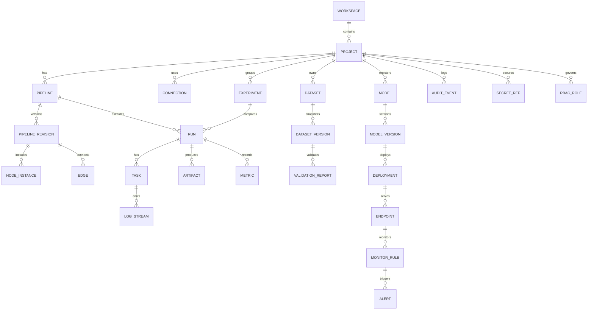

좋아. **“도메인 공통(모든 CV/LLM/Audio/멀티모달/시계열에 
공통으로 깔리는 Control Plane + Data Plane + MLOps 기본)”**을 **UI 껍데기/디자인 설계가 바로 가능하도록** “도메인 엔티티(개념) → 화면 IA(정보구조) → 각 화면 컴포넌트/필드 → 주요 사용자 플로우” 순서로 자세히 정리해줄게.

---

## 1) 공통 도메인 한 장 요약

### 공통 플랫폼이 해야 하는 일(도메인 관점)

* **무엇을 실행할지 정의**: Pipeline(DAG) + Node Template + Parameters
* **어떻게 실행할지 통제**: Run/Task + Retry/Timeout + Resource/GPU + Queue
* **무슨 데이터로 했는지 증명**: Dataset Version + Lineage + Validation
* **어떤 결과가 나왔는지 비교**: Metrics + Artifacts + Reports
* **어떻게 운영할지 유지**: Model Registry + Deployment + Monitor/Alert + Feedback→Retrain

---

## 2) 공통 도메인 모델(엔티티) 설계: UI가 다 보여줘야 하는 “핵심 객체”

아래 엔티티는 거의 모든 MLOps/DAG 플랫폼이 공통으로 갖는 최소 집합이야.
(UI 설계는 “리스트/상세/생성/편집/실행/모니터링” 화면이 이 엔티티들을 중심으로 돌아가면 됨)

### 2.1 핵심 엔티티 목록 (UI 중심)

| 영역      | 엔티티                     | 한 줄 정의                  | UI에서 꼭 필요한 이유              |
| ------- | ----------------------- | ----------------------- | -------------------------- |
| Core    | **Workspace/Project**   | 조직/팀 단위 격리              | 권한/자원/비용/데이터 범위가 여기서 갈림    |
| Control | **Pipeline(DAG)**       | 실행 그래프 정의               | 노드 연결, 파라미터, 실행 정책         |
| Control | **Node Template**       | 재사용 가능한 노드 타입           | CV/LLM 등 도메인 특화 노드도 여기로 확장 |
| Control | **Run**                 | Pipeline 실행 인스턴스        | 상태/로그/비용/결과를 담는 단위         |
| Control | **Task/Step**           | Run 내부의 노드 실행 단위        | 재시도/타임아웃/리소스/로그는 여기서       |
| Control | **Trigger/Schedule**    | 이벤트/크론 기반 실행            | 자동화의 출발점                   |
| Control | **Resource Profile**    | GPU/CPU/Mem/Storage 템플릿 | 사용자가 실수 없이 자원 선택           |
| Data    | **Connection**          | 데이터/스토리지 연결(S3, DB 등)   | UI에서 “어디서 가져오고 어디에 저장하는지”  |
| Data    | **Dataset**             | 논리적 데이터셋(이름/설명)         | 버전/품질/라인리지의 상위 개념          |
| Data    | **Dataset Version**     | 데이터셋의 스냅샷/해시            | “무슨 데이터로 학습했는지” 증빙 핵심      |
| Data    | **Validation Report**   | 스키마/분포/결측/이상치 결과        | 배포/학습 게이트 조건으로 사용          |
| MLOps   | **Experiment**          | 실험 그룹(비교 단위)            | 여러 Run을 묶어 비교              |
| MLOps   | **Metrics**             | 수치 결과(정확도, loss 등)      | 비교/리포트/게이트                 |
| MLOps   | **Artifact**            | 모델/로그/리포트 파일            | 재현/배포/감사에 필수               |
| MLOps   | **Model Registry**      | 모델 버전 관리                | 배포/롤백/승인 흐름의 기준점           |
| MLOps   | **Deployment/Endpoint** | 서빙/배포 상태                | 운영 관점 핵심                   |
| Ops     | **Monitor/Alert**       | 성능/드리프트/오류 알림           | 자동 재학습 트리거와 연결             |
| Gov     | **RBAC/Audit/Secret**   | 권한/감사/시크릿               | 엔터프라이즈 필수, UI에도 반드시 노출     |

---

## 3) UI 정보구조(IA): 사이드바/메뉴 트리 추천

UI 껍데기를 먼저 잡을 때 가장 안전한 “공통 메뉴 구조”야.

* **Home**

  * Overview Dashboard (프로젝트 KPI 요약)
* **Pipelines**

  * Pipeline List
  * Pipeline Builder (DAG Editor)
  * Templates (Node Templates / Parameter presets)
* **Runs**

  * Run List
  * Run Detail (Graph + Logs + Metrics + Artifacts)
* **Data**

  * Connections
  * Datasets
  * Dataset Versions
  * Validation Reports
  * Lineage
* **Experiments**

  * Experiment List
  * Compare View
* **Models**

  * Model Registry
  * Model Version Detail
  * Evaluations (Evaluation Suites / Reports)
* **Deployments**

  * Endpoints
  * Releases / Rollback
* **Monitoring**

  * Metrics/SLI Dashboard
  * Drift/Quality
  * Alerts
  * Feedback Queue
* **Resources**

  * Compute Targets (clusters/agents)
  * Queues/Priorities
  * Resource Profiles
  * Cost/Budget (옵션)
* **Governance**

  * Users/Teams/Roles
  * Audit Log
  * Secrets
  * Policies (승인 게이트 규칙)

---

## 4) A. Control Plane(실행 제어) — 도메인/화면/컴포넌트 설계

### 4.1 Control Plane이 관리하는 상태 모델(런타임 핵심)

**Run 상태(예시)**

* `QUEUED → RUNNING → (SUCCEEDED | FAILED | CANCELED)`
* 중간 상태: `PAUSED`, `RETRYING`, `TIMED_OUT`, `SKIPPED(조건부)`

**Task 상태(노드 실행 단위)**도 동일 계열 + `UPSTREAM_FAILED` 같은 파생 상태가 필요.

➡️ UI는 반드시 **상태 배지**, **상태 타임라인**, **재시도 횟수**, **실패 원인**을 표준으로 보여줘야 함.

---

### 4.2 핵심 화면 1: Pipeline List

**목표:** “무엇이 자동화되어 있는지” 한눈에.

* 테이블 컬럼 추천

  * Name / Owner / Last Run / Success Rate(최근 N회) / Next Schedule / Updated
* 액션

  * Run now / Edit / Clone / Disable schedule / Export(템플릿) / Delete
* 필터

  * Tag, Owner, Status, Last Run 결과, Schedule on/off

---

### 4.3 핵심 화면 2: Pipeline Builder (DAG Editor)

**UI 디자인에서 가장 중요한 화면**. “노드 기반 자동화”의 중심.

**필수 컴포넌트**

1. **Canvas**

* 노드 연결(엣지), 줌/팬, 미니맵
* 노드 상태 색상(실행 시에는 Run 상태 overlay)

2. **Node Palette**

* 카테고리: Common / Data / Train / Eval / Deploy / Ops
* 검색, 즐겨찾기 템플릿

3. **Inspector 패널(우측)**

* Node Params(폼)
* Inputs/Outputs(타입/스키마)
* Retry/Timeout/Resource profile
* 조건부 실행(when), 캐시 사용 여부

4. **Top Actions**

* Validate DAG(사이클/누락 파라미터)
* Dry Run(설정 검증만)
* Run, Save, Versioning(“Pipeline revision”)

**권장 UX**

* 파라미터는 “기본값/오버라이드” 구조로:
  `Pipeline default params` → `Node override params` → `Run-time overrides`
* “실행 정책”은 노드마다 다르게 주되, 기본 템플릿을 제공

---

### 4.4 핵심 화면 3: Run List / Run Detail

#### Run List

* 컬럼: Run ID / Pipeline / Trigger(Manual/Cron/Event) / Started / Duration / Status / Cost(옵션)
* 필터: Status, Time range, Trigger type, Initiator, Tag

#### Run Detail (가장 중요)

Run Detail은 **4-pane 구조**가 UX가 좋음:

1. **Run Summary Header**

* Status badge, Started/Ended, Duration, Trigger, Commit hash(옵션), Dataset version refs

2. **Graph View(실행 그래프)**

* 각 노드별 상태 overlay
* 실패 노드 클릭 시 오른쪽에 Task 상세

3. **Logs**

* 노드별 로그 탭
* “live tail” + 검색/필터
* 에러 하이라이트, 스택트레이스 접기

4. **Outputs**

* Metrics 카드(핵심 메트릭 pin)
* Artifacts 리스트(모델, 리포트, confusion matrix 등)
* Produced datasets(출력 데이터셋 버전 링크)

---

### 4.5 리소스 제어 UI (GPU/큐/분산)

#### Resource Profiles

* 예: `CPU-small`, `GPU-1x`, `GPU-2x`, `HighMem`
* 프로필 상세: cpu/mem/gpu/storage, nodeSelector/constraints, spot 여부(옵션)

#### Queue / Priority

* 큐별 동시성, 최대 실행 수, 우선순위 정책
* UI로 “왜 대기 중인지” 보여주기

  * “GPU 부족” / “우선순위 낮음” / “동시성 제한”

---

### 4.6 승인 게이트(Approval) UI

* 게이트 조건 예:

  * Evaluation score >= threshold
  * Validation report pass
  * Human approval required
* UI 패턴:

  * “Gate 단계 노드”를 DAG에 넣거나,
  * Deployment 시점에 “승인 모달 + 체크리스트 + 근거 링크” 제공

---

## 5) B. Data Plane(데이터 자동화) — 도메인/화면/컴포넌트 설계

### 5.1 Data Plane 핵심: “버전 + 라인리지 + 검증”

UI 목표는 한 문장으로:

* **이 결과가 어떤 데이터에서 왔는지, 신뢰할 수 있는지, 재현 가능한지**를 보여주는 것.

---

### 5.2 Connections 화면

* 타입: S3/MinIO, DB(Postgres), Kafka, File, API 등
* 필드:

  * Name, Type, Endpoint, Credentials ref(Secret), Test connection 버튼
* UX:

  * Secret은 절대 평문 노출 금지
  * Connection health 상태 배지(최근 테스트)

---

### 5.3 Dataset / Dataset Version 화면

#### Dataset (논리 단위)

* 설명, 소유자, 태그, 도메인(CV/LLM/TS 등), 샘플 미리보기(옵션)
* “현재 최신 버전” 링크

#### Dataset Version (스냅샷)

* 필수 메타:

  * version id, created time, size/count, source connection, hash/fingerprint
  * schema snapshot(표/컬럼/타입)
  * partitions(시간/카메라/지역 등)
* UI 핵심 컴포넌트:

  * “Diff view”: 이전 버전 대비 변화(행 수, 컬럼 변화, 분포 변화)
  * “Used by”: 어떤 Run/Model이 이 버전을 썼는지 역참조

---

### 5.4 Validation Report 화면

* 체크 항목 템플릿:

  * schema drift, null ratio, duplicates, outliers, distribution shift(PSI 등), constraints
* UI 패턴:

  * 요약: PASS/WARN/FAIL + Top issues
  * 상세: 룰별 결과 테이블 + 샘플 레코드
* 게이트 연계:

  * “이 Validation이 FAIL이면 Train/Deploy 차단” 같은 정책 표시

---

### 5.5 Lineage 화면(그래프)

* **Dataset Version ↔ Run ↔ Artifact/Model Version** 연결
* UX:

  * 그래프 너무 커지면 “레벨 제한” + “필터(기간/파이프라인)” 필요
  * 클릭 시 side panel로 상세 정보

---

## 6) C. MLOps 기본 — 실험/레지스트리/평가/모니터링 UI 설계

### 6.1 Experiment Tracking UI

#### Experiment List

* Name, Owner, Runs count, Best metric, Last updated

#### Experiment Detail

* Runs table + 비교 선택(checkbox)
* Compare View:

  * 메트릭 비교(테이블 + 차트)
  * 파라미터 diff
  * artifact 비교 링크(리포트, 샘플 결과)

**핵심 UX 포인트**

* “metric pin”: 사용자들이 자주 보는 메트릭을 상단 카드로 고정
* “baseline”: 기준 run 지정 → 나머지 run이 차이로 표시

---

### 6.2 Model Registry UI

#### Model List

* Model name, latest version, stage(dev/stage/prod), owner, last eval score

#### Model Version Detail

* Source: 어떤 Run에서 생성됐는지(링크)
* Artifacts: weights, config, tokenizer, onnx 등
* Evaluation reports: 표준 스위트 결과
* Promotion workflow:

  * `dev → stage → prod` 승격(승인/게이트)
* Rollback:

  * 이전 버전으로 원클릭 롤백(실제 배포 파이프라인과 연결)

---

### 6.3 Evaluation / Report UI

* “표준 평가 스위트”를 템플릿화:

  * 스위트 이름, 포함 테스트, 임계값, 통과 기준
* 결과 UI:

  * PASS/WARN/FAIL
  * 테스트별 상세 + 샘플(실패 케이스 링크)
* 게이트 연계:

  * “통과해야만 배포 가능” 명확히 표시

---

### 6.4 Monitoring / Alert / Feedback UI

#### Monitoring Dashboard

* Endpoint 기준: latency, error rate, throughput, cost(옵션)
* Model quality:

  * 드리프트 지표, 성능 proxy, 데이터 품질 경고
* Alert Center:

  * 알림 리스트(상태: open/ack/resolved)
  * 룰 편집(임계값/윈도우/쿨다운)

#### Feedback Queue

* 사용자 피드백/오탐 샘플/실패 케이스가 모이는 “재학습 입력 버퍼”
* “Create retrain run” 버튼으로 다음 사이클 시작

---

## 7) 공통 UI 컴포넌트 키트(디자인 시스템 관점)

UI 껍데기/디자인 만들 때 재사용률 높은 컴포넌트들:

### 상태/실행 공통

* Status Badge(QUEUED/RUNNING/FAILED…)
* Timeline(Started → Ended, Retry markers)
* Log Viewer(실시간 tail, 검색, 하이라이트)
* Artifact Viewer(파일 리스트 + 미리보기)
* Metric Card(핀 고정/비교)

### 데이터 공통

* Version Chip(v1, hash)
* Diff Panel(전/후 변화)
* Validation Summary Card(PASS/WARN/FAIL)
* Lineage Mini Graph(상세 페이지로 확장)

### 제어 공통

* Resource Profile Selector
* Schedule Builder(CRON UI)
* Trigger Builder(Event 조건)
* Approval Modal(근거 링크 첨부)

### 거버넌스 공통

* RBAC Matrix(역할×권한 표)
* Audit Log Table(필터/검색/원본 JSON)
* Secret Reference Picker(실제 값 비노출)

---

## 8) “공통 도메인” 기준 핵심 사용자 플로우 3개 (UI 설계용)

### 플로우 1: 파이프라인 만들고 실행

1. Pipelines → New Pipeline
2. DAG Editor에서 노드 배치/연결
3. Node param 입력 + Resource profile 선택
4. Validate → Run
5. Run Detail에서 실패 노드 확인/재시도

### 플로우 2: 데이터 버전 확보 + 검증 후 학습

1. Data → Connection 생성(Test)
2. Dataset 생성 → Ingest 실행
3. Dataset Version 생성(스냅샷)
4. Validation 실행 → PASS 확인
5. Train Run이 Dataset Version을 참조하여 실행

### 플로우 3: 모델 등록 → 평가 통과 → 배포 → 모니터링 → 재학습

1. Run 결과 artifact에서 Register Model
2. Evaluation Suite 실행 → 기준 통과
3. 승인 게이트(필요 시) → Promote to prod
4. Deployment/Endpoint 모니터링
5. Drift/Alert 발생 → Feedback Queue → Retrain Trigger

---

## 9) (선택) 공통 도메인 ERD Mermaid (UI-데이터 모델 합의용)

---

원하면 다음 단계로 바로 갈 수 있어:

* 이 공통 도메인을 기반으로 **“실제 화면 와이어프레임(페이지별 레이아웃/컴포넌트 배치)”**를 텍스트로 쫙 뽑아주거나,
* 네가 쓰는 스택 기준(React/Next + ReactFlow + shadcn/ui 같은)으로 **컴포넌트 트리/라우팅 구조**까지 설계해줄게.

이제 ai_operation ui 및 디자인 설계할껀데 가장 현대적이고 가장 자주 사용되는 UI와 디자인으로 설계해주고 코드 만들어주는데 react 기반으로 만들어주고 껍데기만 만들어주면돼
즉, 요구사항은
1. 기획서에 쓸 UI 및 디자인
2. 기능은 추가되면 안되고 내용은 보여줄 수 있어야됨
3. 현재는 공통 도메인 기반이고 문제 유형별로 확장 가능하게 설계 및 UI 제작

이런 프로젝트를 만들었는데 현재 기능 파악이랑 잘못 구현된 부분 UI 이상한 부분 판단해서 다 수정해줘

그리고 디자인도 현대적이고 이쁘게 만들어줘